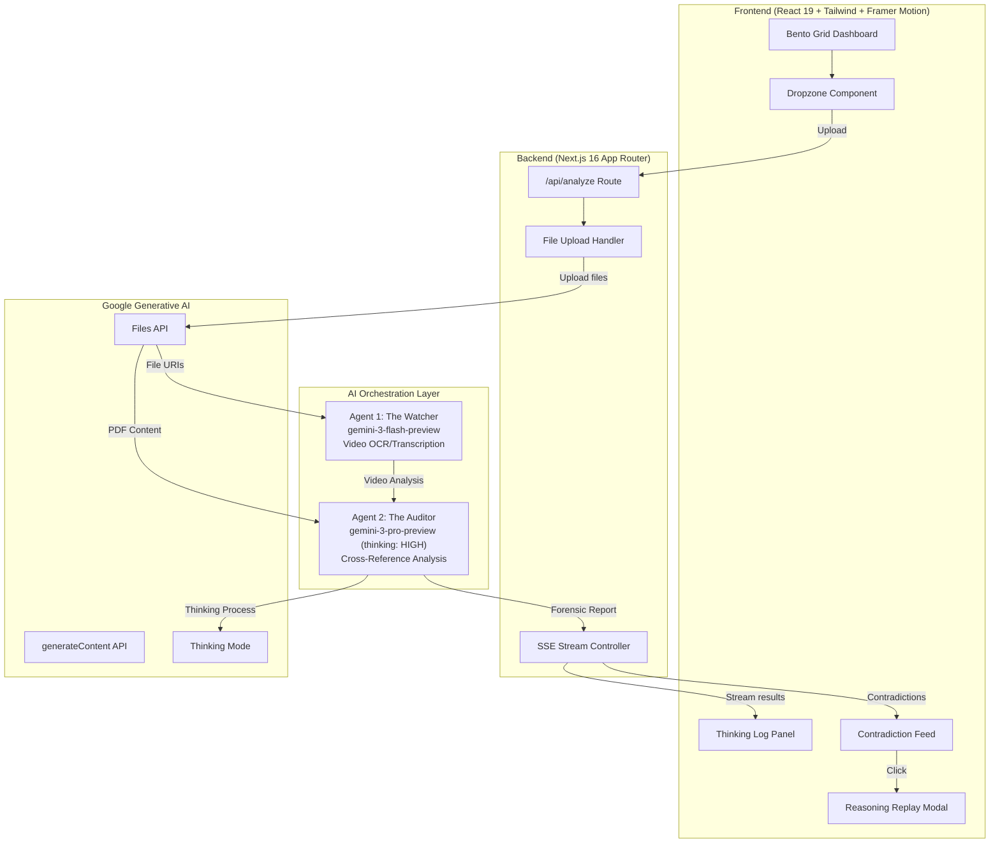

# VeraGate: Gemini 3 Features Documentation

## Overview

VeraGate is a multimodal forensic audit engine that leverages Google's Gemini 3 models to detect contradictions between video evidence and technical documentation. This document outlines the Gemini 3 features and capabilities used in the implementation.

---

## Gemini Models Used

### 1. Gemini 3 Flash (The Watcher Agent)

**Model ID:** `gemini-3-flash-preview`

**Purpose:** Fast video analysis, OCR, and transcription

**Capabilities Used:**

- Multimodal understanding (video input)
- Text extraction from video frames (OCR)
- Speech-to-text transcription
- Spatial analysis (object positions, lighting, shadows)
- Timestamp extraction and event detection

**Why Flash?**

- Optimized for high-volume, low-latency processing
- Efficient for initial video analysis
- Cost-effective for detailed frame-by-frame analysis
- Fast enough for real-time streaming updates

---

### 2. Gemini 3 Pro with Thinking (The Auditor Agent)

**Model ID:** `gemini-3-pro-preview`

**Purpose:** Deep forensic cross-referencing and contradiction detection

**Configuration:**

```typescript
config: {
  thinkingConfig: {
    thinkingLevel: ThinkingLevel.HIGH,
  },
  responseMimeType: "application/json",
}
```

**Capabilities Used:**

- Extended thinking with `thinkingLevel: "HIGH"`
- Long-context document understanding (up to 1M tokens)
- Multi-step reasoning chains
- Structured JSON output generation
- Cross-modal reference comparison

**Why Pro with Thinking?**

- Superior reasoning for complex forensic analysis
- Ability to cross-reference large PDF documents with video observations
- Deep thinking mode surfaces subtle contradictions
- High accuracy for critical audit decisions
- JSON response format ensures reliable parsing

---

## Gemini Files API

**Purpose:** Handle large file uploads (video up to 2GB, PDF up to 50MB)

**Implementation:**

```typescript
// Upload video file
const uploadedVideo = await ai.files.upload({
  file: new Blob([videoBuffer], { type: videoFile.type }),
  config: { mimeType: videoFile.type },
});

// Upload PDF file
const uploadedPdf = await ai.files.upload({
  file: new Blob([pdfBuffer], { type: pdfFile.type }),
  config: { mimeType: pdfFile.type },
});

// Wait for processing completion
let fileState = await ai.files.get({ name: uploadedVideo.name });
while (fileState.state === "PROCESSING") {
  await new Promise((resolve) => setTimeout(resolve, 2000));
  fileState = await ai.files.get({ name: uploadedVideo.name });
}
```

---

## Architecture Diagram



---

## Contradiction Types Detected

| Type              | Icon | Description                          | Example                                    |
| ----------------- | ---- | ------------------------------------ | ------------------------------------------ |
| **Spatial**       | 🗺️   | Physical positions don't match specs | Component installed in wrong location      |
| **Temporal**      | ⏰   | Time indicators contradict claims    | Shadows indicate different time of day     |
| **Factual**       | 📋   | Information directly contradicts     | Different quantities in video vs. document |
| **Specification** | 📐   | Technical specs violated             | Dimensions don't match blueprint           |

---

## Key Technical Decisions

1. **No RAG Required** — Full PDF context ingestion using Gemini's 1M token window eliminates the need for retrieval-augmented generation
2. **Server-Sent Events** — Real-time streaming of analysis progress and thinking tokens
3. **Structured Output** — JSON response format with `responseMimeType: "application/json"` for reliable parsing
4. **Two-Agent Architecture** — Separation of concerns between video analysis (Flash) and forensic audit (Pro)
5. **Thinking Mode (HIGH)** — Extended reasoning capabilities for detecting subtle contradictions

---

## API Usage Example

```typescript
import { GoogleGenAI, ThinkingLevel } from "@google/genai";

// Initialize the AI client
const ai = new GoogleGenAI({ apiKey: process.env.GEMINI_API_KEY });

// Upload files using Files API
const video = await ai.files.upload({
  file: videoBlob,
  config: { mimeType: "video/mp4" },
});
const pdf = await ai.files.upload({
  file: pdfBlob,
  config: { mimeType: "application/pdf" },
});

// Agent 1: The Watcher - Video Analysis
const watcherResult = await ai.models.generateContent({
  model: "gemini-3-flash-preview",
  contents: [
    {
      role: "user",
      parts: [
        { fileData: { fileUri: video.uri, mimeType: "video/mp4" } },
        { text: "Analyze this video for forensic evidence..." },
      ],
    },
  ],
});

// Agent 2: The Auditor - Cross-Reference with Thinking
const auditorResult = await ai.models.generateContent({
  model: "gemini-3-pro-preview",
  contents: [
    {
      role: "user",
      parts: [
        { fileData: { fileUri: pdf.uri, mimeType: "application/pdf" } },
        {
          text: `Video analysis: ${watcherResult.text}\n\nPerform forensic audit...`,
        },
      ],
    },
  ],
  config: {
    thinkingConfig: { thinkingLevel: ThinkingLevel.HIGH },
    responseMimeType: "application/json",
  },
});
```

---

## Response Format

The Auditor agent returns structured JSON in the following format:

```json
{
  "summary": "Overall audit summary",
  "contradictions": [
    {
      "id": "C001",
      "severity": "critical",
      "type": "spatial",
      "videoTimestamp": "00:01:23",
      "pdfPage": 5,
      "pdfClause": "Equipment shall be installed at position A",
      "videoObservation": "Equipment visible at position B",
      "reasoning": "Detailed reasoning chain...",
      "confidence": 0.95
    }
  ],
  "verifiedFacts": [
    {
      "id": "V001",
      "videoTimestamp": "00:00:45",
      "pdfPage": 2,
      "description": "Serial number matches",
      "evidence": "Serial number ABC-123 visible in video matches PDF specification"
    }
  ]
}
```

---

## Streaming Protocol (SSE)

The API endpoint streams progress updates using Server-Sent Events:

```typescript
// Event types
type SSEEvent =
  | { event: "status"; data: { message: string; progress: number } }
  | {
      event: "thinking";
      data: { agent: string; phase: string; content: string };
    }
  | { event: "result"; data: ForensicAuditResult }
  | { event: "error"; data: { message: string } };
```

---

## Performance Characteristics

| Metric             | Value           |
| ------------------ | --------------- |
| Video upload limit | 2GB             |
| PDF upload limit   | 50MB            |
| Context window     | 1M tokens       |
| Thinking level     | HIGH            |
| Response format    | JSON            |
| Streaming          | SSE (real-time) |

---

_Built with Google Gemini 3 for the Gemini Developer Competition_
