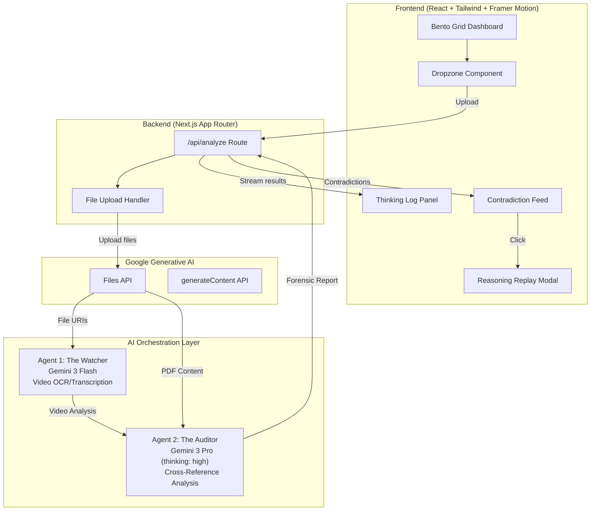

# VeraGate: Gemini 3 Features Documentation

## Overview

VeraGate is a multimodal forensic audit engine that leverages Google's Gemini 3 models to detect contradictions between video evidence and technical documentation.

## Gemini Models Used

### 1. Gemini 3 Flash (The Watcher Agent)

**Model ID:** `gemini-2.0-flash`

**Purpose:** Fast video analysis and OCR/transcription

**Capabilities Used:**

- Multimodal understanding (video input)
- Text extraction from video frames
- Speech transcription
- Spatial analysis (object positions, lighting, shadows)
- Timestamp extraction

**Why Flash?**

- Optimized for high-volume, low-latency tasks
- Efficient for initial video processing
- Cost-effective for detailed frame-by-frame analysis

---

### 2. Gemini 3 Pro with Thinking (The Auditor Agent)

**Model ID:** `gemini-2.0-pro-exp-02-05`

**Purpose:** Deep forensic cross-referencing and contradiction detection

**Configuration:**

```typescript
config: {
  thinkingConfig: {
    thinkingLevel: ThinkingLevel.HIGH,
  },
  responseMimeType: "application/json",
}
```

**Capabilities Used:**

- Extended thinking with `thinkingLevel: "high"`
- Long-context document understanding (up to 1M tokens)
- Multi-step reasoning chains
- Structured JSON output generation

**Why Pro with Thinking?**

- Superior reasoning for complex forensic analysis
- Ability to cross-reference large PDF documents with video observations
- Deep thinking mode surfaces subtle contradictions
- High accuracy for critical audit decisions

---

## Gemini Files API

**Purpose:** Handle large file uploads (video up to 2GB, PDF up to 50MB)

**Usage:**

```typescript
const uploadedVideo = await ai.files.upload({
  file: videoBlob,
  config: { mimeType: "video/mp4" },
});

// Wait for processing
let fileState = await ai.files.get({ name: uploadedVideo.name });
while (fileState.state === "PROCESSING") {
  await new Promise((resolve) => setTimeout(resolve, 2000));
  fileState = await ai.files.get({ name: uploadedVideo.name });
}
```

---

## Architecture Diagram



---

## Contradiction Types Detected

| Type              | Description                          | Example                                    |
| ----------------- | ------------------------------------ | ------------------------------------------ |
| **Spatial**       | Physical positions don't match specs | Component installed in wrong location      |
| **Temporal**      | Time indicators contradict claims    | Shadows indicate different time of day     |
| **Factual**       | Information directly contradicts     | Different quantities in video vs. document |
| **Specification** | Technical specs violated             | Dimensions don't match blueprint           |

---

## Key Technical Decisions

1. **No RAG** - Full PDF context ingestion using Gemini's 1M token window
2. **Server-Sent Events** - Real-time streaming of thinking tokens
3. **Structured Output** - JSON response format for reliable parsing
4. **Two-Agent Architecture** - Separation of concerns between analysis and audit

---

## API Usage Example

```typescript
import { GoogleGenAI, ThinkingLevel } from "@google/genai";

const ai = new GoogleGenAI({ apiKey: process.env.GEMINI_API_KEY });

// Upload files
const video = await ai.files.upload({
  file: videoBlob,
  config: { mimeType: "video/mp4" },
});
const pdf = await ai.files.upload({
  file: pdfBlob,
  config: { mimeType: "application/pdf" },
});

// The Watcher - Video Analysis
const watcherResult = await ai.models.generateContent({
  model: "gemini-2.0-flash",
  contents: [
    { fileData: { fileUri: video.uri, mimeType: "video/mp4" } },
    { text: "Analyze this video for forensic evidence..." },
  ],
});

// The Auditor - Cross-Reference
const auditorResult = await ai.models.generateContent({
  model: "gemini-2.0-pro-exp-02-05",
  contents: [
    { fileData: { fileUri: pdf.uri, mimeType: "application/pdf" } },
    {
      text: `Video analysis: ${watcherResult.text}\n\nPerform forensic audit...`,
    },
  ],
  config: {
    thinkingConfig: { thinkingLevel: ThinkingLevel.HIGH },
    responseMimeType: "application/json",
  },
});
```
